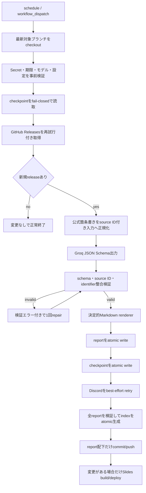

# Claude Code Updates 包括改善設計

## 1. 目的

日次更新処理を、障害時にデータを欠落させず、生成物以外を誤って公開せず、
公式リリースノートに追跡可能なレポートだけを継続生成できる状態にする。
同時に、Pull Request 上で同じ品質基準を自動検証し、依存更新を安全に継続できるようにする。

## 2. 調査結果と採否

| 分野 | 候補 | 優先度 | 判断 |
|---|---|---:|---|
| 状態管理 | 壊れた `last-checked.json` を初回実行扱いしない | P0 | 実装 |
| 状態管理 | レポートとチェックポイントの原子的保存 | P0 | 実装 |
| GitHub Actions | 待機中runの古いcheckoutを最新ブランチへ同期 | P0 | 実装 |
| GitHub Actions | 変更検出・stage対象を `reports/claude-code` に限定 | P0 | 実装 |
| レポート | LLM出力を構造化し、原文の出典IDを必須化 | P0 | 実装 |
| レポート | 全121件をH1→H2→H3の階層へ正規化 | P0 | 実装 |
| プライバシー | 公開workflowでローカルproject catalogを使用しない | P0 | 実装 |
| CI | pytest、Ruff、actionlint、全レポート・索引検証 | P0 | 実装 |
| API | GitHub/Groq/Discordの一時障害・rate limit処理 | P1 | 実装 |
| 設定 | 最大10件、期限形式、Webhook URL、モデル一覧を厳密検証 | P1 | 実装 |
| 索引 | parse失敗を黙って除外せず、重複・欠落を拒否して原子的生成 | P1 | 実装 |
| Slides | セクション単位分割、過密検査、no-op日の再配備停止 | P1 | 実装 |
| 依存 | hash付きPython lock、Marp lock、Dependabot | P1 | 実装 |
| Supply chain | GitHub Actionsをcommit SHAへ固定 | P1 | 実装 |
| 運用 | モデルをRepository variableで切替可能にする | P1 | 実装 |
| 過去データ | 指摘済みの誤訳・誤分類を公式ノートに合わせて訂正 | P1 | 実装 |
| 品質 | 公式リンクを定期的に全件ネットワーク検査 | P2 | 見送り |
| 監視 | GitHub外部から日次run欠落を監視 | P2 | 見送り |
| LLM | 別モデルへ自動fallback | P2 | 見送り |
| Pages | GitHub公式Pages Actionsへ移行 | P3 | 見送り |

見送り理由は、リンク検査が外部障害でCIを不安定にすること、外部監視には別サービスの
契約・認証が必要なこと、自動fallbackはレポート品質を通知なく変えること、Pages基盤変更は
今回の障害修正と独立しておりリポジトリ設定変更を伴うためである。

## 3. 実行アーキテクチャ

## 4. 不変条件

### 4.1 状態とリリース入力

- checkpointが存在する場合、JSON object、非空のsemver `last_version`、ISO日時を必須とする。
- checkpointが存在しない状態を初回と認めるのは、レポートファイルも存在しない場合だけとする。
- `tag_name`、`published_at`、本文型が不正なreleaseは現在日へ補完せず停止する。
- 1runの処理数は1〜10件とし、10を超える設定はエラーにする。
- reportの保存完了後にcheckpointを進める。Discord失敗はcheckpointを巻き戻さない。

### 4.2 LLM境界

- 公開workflowの生成経路ではproject catalogを一切読まない。ローカルのカタログ生成ツールは
  独立機能として残すが、公開レポート生成には接続しない。
- モデルにはsystem指示とuser supplied release notesを分離して渡す。
- 公式ノートの各変更項目に `R1`、`R2` のsource IDを付与する。
- 生成される要約・変更・影響・対応の各claimは1件以上のsource IDを持つ。
- source IDが存在しない、原文にないbacktick識別子がある、許可外判定値がある場合は保存しない。
- JSON Schemaまたは意味検証に失敗した場合は、検証結果を添えて1回だけrepairする。
- 2回失敗時はreportとcheckpointを変更せずrunを失敗させる。

### 4.3 Markdownと索引

- H1はレポートタイトルだけ、canonical sectionはH2、変更カテゴリはH3とする。
- anchorは一意で、定義済み順序と見出し名に一致させる。
- filename、H1 version、release URL tag、ヘッダー日付を一致させる。
- index生成は全reportのparse成功、version重複なし、全ファイル包含を前提とする。
- indexの並び順はファイル時刻ではなくsemver降順とする。
- `index.md` と `index.json` は検証後にatomic replaceする。

### 4.4 GitHub Actionsと依存

- schedule/dispatchはjob開始時点の対象ブランチ最新commitを使う。
- 変更検出、stage、commit対象は `reports/claude-code` のみに揃える。
- commit versionはmtimeではなくcheckpointのversionから取得する。
- Python本番・開発依存は推移依存を含めhash付きで固定する。
- Marpは `package-lock.json` と `npm ci` で固定する。
- 外部Actionはcommit SHAに固定し、Dependabotで週次更新する。

## 5. コンポーネント設計

### 5.1 `scripts/check-claude-updates.py`

- 設定読取、checkpoint store、HTTP retry、release正規化、source抽出、LLM生成、rendererを
  小さな純粋関数へ分離する。既存CLIと出力パスは維持する。
- `CLAUDE_UPDATES_GROQ_MODEL` を任意設定とし、未設定時は `openai/gpt-oss-120b` を使う。
- GitHub GETは接続障害、429、5xx、rate-limit由来403だけ最大3回再試行する。
- Groqの日次request resetが60秒を超える場合は再送せず、次回runを促して停止する。
  既存互換の `Retry-After` とtoken resetは最大60秒へ制限して再試行する。
- Discordは429、5xx、接続障害だけ再試行し、例外ログにWebhook URLを含めない。

### 5.2 `scripts/report_generation.py` / `scripts/report_schema.py`

- `report_generation.py` がLLM JSON Schema、出典の意味検証、Markdown rendererを担当し、
  `report_schema.py` が生成後Markdownと既存corpusを検証する。
- 旧H3 parser互換は残すが、新規生成とcorpus migrationはH2を必須とする。
- 既存のindex JSONキーとレポートURLは変更しない。

### 5.3 `scripts/generate-index.py`

- parse不能をskipせず、対象ファイル名を含むエラーにする。
- `--check` でcorpusと既存indexの集合・順序・内容一致を検証する。
- 一時ファイルを書き、flush/fsync後にreplaceする。

### 5.4 Slides

- anchor/canonical sectionごとに改ページする。
- `changes` はH3カテゴリごとに別スライドへ分割する。
- 1枚の非空行・箇条書き上限をテストし、過密な入力はCIで検出する。
- 更新workflowが変更をcommitした場合だけ自動再配備する。pushと手動実行は維持する。

## 6. テスト設計

- 設定境界: 最大1/10/11、期限のcompact/week-date/閏日、HTTPS URL。
- checkpoint: 欠落、破損、キー欠落、semver不正、atomic replace失敗。
- HTTP: GitHub/Discord/Groqの429、5xx、connection、非retry 4xx、長すぎる待機。
- LLM: JSON不正、source ID不正、原文にないidentifier、repair成功/失敗、prompt injection文字列。
- golden: v2.1.212、v2.1.216、および既知誤訳の短縮fixture。
- corpus: 121件のschema・見出し・filename/version/date/link、index集合、重複、semver順。
- Slides: canonical分割、changesカテゴリ分割、行数上限、代表reportのMarp HTML変換。
- Workflow: actionlint、path限定、checkpoint由来version、no-opでcommit/deployなし。
- CI: Python 3.11で全pytest、Ruffの重大な構文・未定義名（`E7,E9,F`）、actionlint、
  index `--check` を必須にする。既存Ruff違反の全rule適用は目的別の後続変更とする。

## 7. ロールアウト

1. 既存121レポートを機械的にH2へ移行し、既知7件の意味誤りを公式ノートに沿って訂正する。
2. 索引を再生成して121件・最新version・URL集合が不変であることを確認する。
3. 新生成経路、状態/API耐障害性、CI/lock、Slidesを同一PRで統合する。
4. PRブランチでpytest、Ruff、actionlint、Marp smoke、実Groq model preflightを実行する。
5. レビュー指摘を解消後にmainへmergeし、mainのno-op runとSlidesの条件分岐を確認する。

## 8. 完了条件

- 選定したP0/P1項目がテスト付きで実装される。
- 既存公開URL・ファイル名・index JSON既存キーが維持される。
- 全ローカル検証とPR checksが成功する。
- PR #2の現行mainに該当する未解決指摘へ対応内容を返信し、解決済みにする。
- mainへmerge後、更新workflowが成功し不要commitを作らない。
